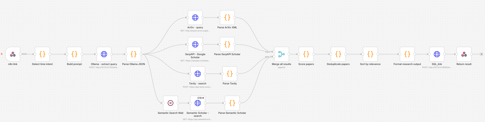

# 🔬 Paper Search Agent: The Neural Research Concierge

> **Automate your literature review.** Bridge the gap between disparate academic databases using a locally-orchestrated neural pipeline.

[](https://n8n.io/)
[](https://ollama.ai/)
[](https://fastapi.tiangolo.com/)
[](https://streamlit.io/)

---

## 🌊 The Vision

Finding relevant research papers in 2026 is an exercise in managing noise. Between ArXiv, Google Scholar, and Semantic Scholar, researchers are forced to navigate fragmented interfaces and repetitive results. I used this opportunity to leverage almost free resources on creating an agent that does the job as I would like.

The **Paper Search Agent** is a unified ecosystem designed to act as a personal research assistant. By combining **Local AI (Ollama)** for intent extraction, **n8n** for multi-threaded orchestration, and a **FastAPI/SQLite** stack for permanent memory, it delivers a high-resolution window into the latest scientific breakthroughs. At the same time, everything is limited to your local PC.

---

## 🏎️ The Neural Pipeline (Architecture)

The system operates as a tiered "Reasoning & Retrieval" engine. Unlike simple search bars, this agent processes your query through a sophisticated multi-stage workflow:



### 1. Intent Extraction (The "Brain")
When you type a query like *"latest advances in LLM quantization 2025"*, the **Ollama** node (running `qwen3:4b`) strips away the natural language to extract raw, search-optimized keywords. It simultaneously detects **Time Constraints** to prioritize the most recent papers.

### 2. Multi-Threaded Retrieval (The "Nervous System")
The agent branches into four parallel search streams:
*   **ArXiv**: Deep-parsing XML results for bleeding-edge pre-prints.
*   **Google Scholar**: Leveraging the wide-net visibility of SerpAPI.
*   **Tavily AI**: Scanning web pre-prints and non-standard journals.
*   **Semantic Scholar**: Enriching entries with citation counts and formal abstracts.

### 3. Synthesis & Memory (The "Permanent Archive")
Once data is retrieved, a custom **Scoring Engine** ranks papers based on:
- **Query Match Density** (Title vs. Keywords)
- **Cumulative Citation Impact** (Authority)
- **Year Relevance** (Recency)

Finally, results are deduplicated and saved to your local `memory.db`, ensuring you have a permanent, searchable record of your research history.

---

## 🚀 Getting Started

### 1. Prerequisites
*   **n8n Desktop/Self-hosted**: [Install here](https://n8n.io/)
*   **Ollama**: [Install here](https://ollama.ai/) and run `ollama pull qwen3:4b`.
*   **Python 3.10+**: For the UI and Backend.

### 2. Setup the Neural Backend (n8n)
1.  Import `Paper Search Agent.json` into n8n.
2.  Set the workflow to **Active**.
3.  Ensure your API keys are configured in the `SerpAPI` and `Tavily` nodes.

### 3. Launching the Local Services

Open two terminals in the project folder:

**Terminal A: The Memory API**
```powershell
pip install -r requirements.txt  # If not already installed
uvicorn memory_api:app --reload --port 8000
```

    **Terminal 2 (Frontend Discovery UI)**:
    ```bash
    streamlit run app.py
    ```

---

## 📁 Project Anatomy

*   `app.py`: The **Discovery UI**. A premium Streamlit dashboard featuring glassmorphism elements, persistent state, and high-performance card rendering.
*   `memory_api.py`: The **Memory Hub**. A FastAPI service that bridges the n8n cloud logic with your local SQLite storage.
*   `Paper Search Agent.json`: The **Logic Graph**. The full blueprint for the n8n orchestrator.
*   `memory.db`: Your **Private Archive**. A local SQLite database containing every search insight you've generated.
*   `API_KEYS.md`: Configuration guide for SerpAPI and Tavily credentials.

---

## 🛠️ Engine Configuration

The application is built to be flexible. If your n8n instance is running on a different port or server, you can dynamically update the **Engine URL** directly within the `Engine & Config` tab of the Streamlit UI.

---

## 📜 License & Credits
Licensed under the **MIT License**.
*Architecture & Development by **Ali Baghi Zadeh**.*
